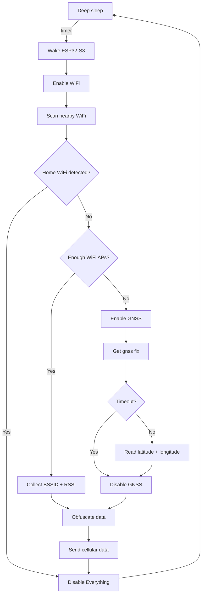

## Workflow

### On the device

#### C/C++ or MicroPython?

There are example repos for both, [C/C++](github.com/Xinyuan-LilyGO/LilyGo-T-SIM7080G) and [MicroPython](github.com/Xinyuan-LilyGO/LilyGo-T-SIM7080G-MicroPython). I chose MicroPython, because it feels much better for me.

### At the server

I don't have any public webserver. Only my home lab in my private network. Recently, I started to use [ntfy](https://ntfy.sh/) with the [Molly messenger](https://molly.im/) (a fork of [Signal](https://signal.org/) with [UnifiedPush](https://unifiedpush.org/) support). The idea is to push the data from the remote device to a channel at the ntfy server and subscribe to that channel from the server in my local network. I use the [free ntfy server from Adminforge](https://adminforge.de/service-ntfy-push-dienst). They even fixed a bug (HTTP1.1 didn't work in some cases) in two days! Finally, the script that subscribes to the ntfy topic, can process and forward the data. In my case to a self-hosted [Traccar](https://www.traccar.org/) instance.
