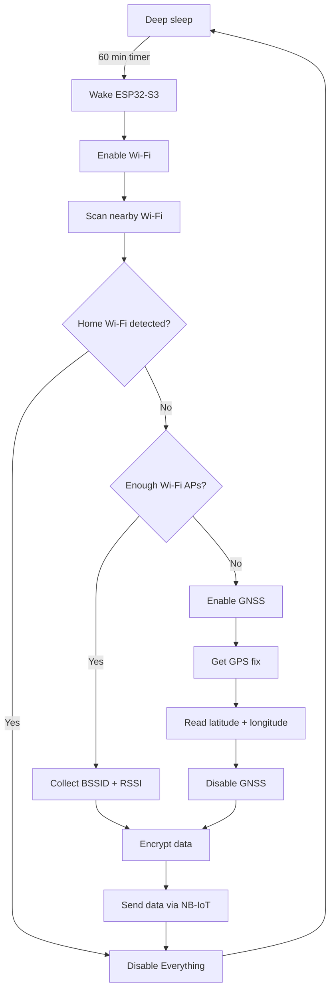

## Hardware

- [T-SIM7080G S3](https://www.amazon.de/dp/B0BW3NN54L/)
- IOT SIM
- Battery

## Software

- SW on device
- ntfy server
- ntfy to traccar script
- Selfhosted traccar instance

## Repository Structure

- ntfy_traccar_bridge
- tracker_firmware, based on the [lilygo examples](https://github.com/Xinyuan-LilyGO/LilyGo-T-SIM7080G/)

# TODO

- [ ] [Battery](https://www.idealo.de/preisvergleich/Liste/111758360/18650-mit-schutzschaltung.html)
  - https://www.idealo.de/preisvergleich/OffersOfProduct/202736142_-inr18650-35e-3500mah-3-6v-samsung.html
  - https://www.idealo.de/preisvergleich/OffersOfProduct/206289328_-inr18650-m35a-3500mah-molicel.html
- [ ] [IOT SIM](https://www.idealo.de/preisvergleich/MainSearchProductCategory.html?q=iot+sim)
  - https://simbase.com/de/best-iot-sim-card/germany
  - https://shop.dptechnics.com/home/1-250mb-worldwide-m2m-sim.html
- [ ] Selfprinted case

##

- AES ECB: https://www.luisllamas.es/en/how-to-use-aes128-on-esp32/#extra-bonus-ecb-encryption
- WiFi.h: https://github.com/espressif/arduino-esp32/blob/master/libraries/WiFi/src/WiFi.h

One important detail: use the BSSID (MAC address) of your home access point, rather than just the SSID. The SSID can be duplicated by other networks, whereas the BSSID identifies your specific AP.
