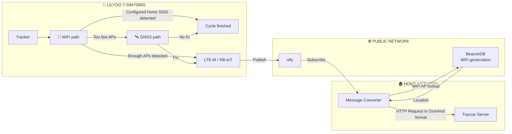

# Marph's Tracker

A small, battery-powered Wi-Fi/GNSS tracker based on the LilyGO T-SIM7080G-S3 and MicroPython.

## Motivation

I want a theft protection for our new stroller.

Requirements:

- Small and mobile
- Cheap
- Can send from any location to a configurable endpoint
- Without vendor-lock (no app/registration)

## Overview

- Hardware:
  - LILYGO T-SIM7080G-S3 including GNSS and LTE antenna
  - 18650 battery
  - IoT SIM card
- Location methods:
  - WiFi (+ cell data) -> [BeaconDB](https://beacondb.net/)
  - GNSS
- Cellular connectivity: LTE-M or NB-IoT

The tracker obtains the location based on GNSS or WIFI. This data is sent to a configurable URL. In my case, this is a NTFY instance. A custom script subscribes to the NTFY instance, converts the data and forwards it to a self-hosted Traccar server in my home lab.

Please check the [documentation](./docs/) for setup instructions and further details:

- [Quick start](./docs/quickstart.md)
- [Software implementation details](./docs/software.md)
- [Battery life estimation](./docs/battery.md)
- [Cost estimation](./docs/costs.md)
- [Search for a good LTE-M or NB-IoT SIM card](./docs/cellular_data.md)

## Example Deployment

## Abbreviations

| Abbreviation   | Description                                                               |
| -------------- | ------------------------------------------------------------------------- |
| AP             | Access Point. I.e. a WiFi network.                                        |
| APN            | Access Point Name. Gateway for the cellular data.                         |
| BSSID          | Basic Service Set Identification. I.e. the MAC address of the WiFi.       |
| GNSS           | Global Navigation Satellite System. For example GPS or Galileo.           |
| LTE-M / NB-IoT | Narrowband Cellular Standards for mobile data.                            |
| RSSI           | Received Signal Strength Indicator. I.e. the strength of the WiFi signal. |
| SSID           | Service Set Identifier. I.e. the name of the WiFi.                        |

## Code structure

| File/Folder         | Content                                                            |
| ------------------- | ------------------------------------------------------------------ |
| .github/workflows   | Github CI                                                          |
| docs                | Documentation                                                      |
| firmware            | Firmware running on the device                                     |
| ntfy_traccar_bridge | Bridge scripts running on the server at a machine in local network |
| flash_firmware.bash | Flash the firmware to the device                                   |

## Similar projects

- https://github.com/eaxsi/sim7000-tracker
- https://github.com/onlinegill/LILYGO-TTGO-T-SIM7000G-ESP32-Traccar-GPS-tracker
- https://github.com/Wovyn/lilygo-t-sim7000g-asset-tracker-example
